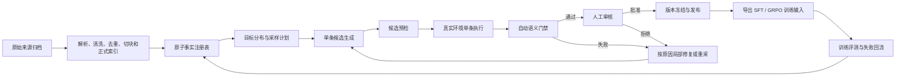

# SFT（监督微调）数据自动处理流程优化方案

## 1. 文档定位

- 文档状态：**方案已整理，尚未实施本轮 SFT（监督微调）流水线重构。**
- 适用范围：后续训练数据的事实登记、候选生成、真实执行、自动门禁、局部重采、人工审核、冻结发布，以及向 SFT（监督微调）和 GRPO（组相对策略优化）导出训练所需数据。
- 当前基线：继续使用已经冻结的 `sft-v2-reviewed-75-v1`，本方案不得反向修改该版本。
- 实施优先级：当前先打通已经确定的 GRPO（组相对策略优化）训练闭环；SFT（监督微调）数据生产优化后续单独立项实施。

本方案解决的不是“怎样写一个更复杂的生成提示词”，而是怎样把数据生产改造成一套**可追踪、可回放、可审核、可局部重试、可版本复现**的工程流水线。

## 2. 当前事实与边界

### 2.1 已冻结的数据基线

当前唯一正式冻结的 SFT V2（监督微调第二版）数据为：

| 项目 | 当前口径 |
| --- | --- |
| 冻结版本 | `sft-v2-reviewed-75-v1` |
| 冻结状态 | `frozen_with_legacy_exceptions`（带旧数据例外冻结） |
| 来源轨迹 | 75 条：37 条旧保留轨迹 + 38 条第三轮审核通过轨迹 |
| SFT（监督微调）动作样本 | 163 条：旧数据 84 条 + 新数据 79 条 |
| 数据集指纹 | `92e8146962d6fddc44a8fc1c001ff5306bc01cb6d2c3c7f0866db8d15aeae0e6` |
| 冻结目录 | `evaluation/stage9/artifacts/sft_v2/frozen_reviewed_75_v1/` |
| 训练状态 | 未运行 SFT V2（监督微调第二版）训练 |

冻结检查结果：完全重复 0 条，新数据或跨代近义重复 0 条，`split`（数据切分）问题泄漏 0 条，`split`（数据切分）文本块泄漏 0 条。37 条旧数据中保留 3 组历史近义样本和 1 条历史路线元问题，均已作为旧数据例外显式登记。

### 2.2 已完成的 GRPO（组相对策略优化）数据投影

GRPO（组相对策略优化）数据处理不另建一套候选生成流水线。当前已经把上述 75 条冻结来源轨迹投影为 75 条仅训练案例：

- 正式共享实现：`app/rag/evaluation/grpo_case_exporter.py`；
- 阶段入口：`evaluation/stage9/grpo/export_sft_v2_grpo_cases.py`；
- 输出目录：`evaluation/stage9/artifacts/grpo/sft_v2_reviewed_75_v1/`；
- 数据版本：`grpo-cases-from-sft-v2-reviewed-75-v1`；
- 共 75 条案例、65 个 `leakage_group_id`（泄漏分组标识）；
- 终态分布：60 条回答、7 条追问、8 条拒答；
- 已绑定 Reward v1.1（奖励规则第一点一版）配置、环境快照和输入文件 SHA256（文件内容哈希）；
- 未生成 `rollout`（训练时策略采样轨迹）、未调用 Provider（动作执行器/环境结果提供器）、未运行训练。

GRPO（组相对策略优化）的 `rollout`（训练时策略采样轨迹）属于训练阶段，不属于本方案的数据生产阶段。GRPO（组相对策略优化）可以复用 SFT（监督微调）的案例事实、答案要点、允许路线、证据和安全边界，由 Reward（奖励分数计算器）对训练时新生成的轨迹打分；不能把 163 条逐动作 SFT（监督微调）记录直接当作 163 条独立 GRPO（组相对策略优化）案例。

### 2.3 本方案不做的事情

- 不修改或重新冻结现有 75 条轨迹。
- 不恢复已经拒绝的 87 条第三轮审核候选或 8 条抢救失败候选。
- 不为满足路线数量强制生成 HyDE（假设文档改写检索）或 Web Search（网页检索）数据。
- 不把阶段产物目录改造成正式公共代码目录。
- 不在本方案中运行 SFT（监督微调）、GRPO（组相对策略优化）训练或训练时 `rollout`（策略采样轨迹）。
- 不把开发集、留出测试集或失败回归集混入仅训练数据。

## 3. 多轮数据生产暴露的问题

### 3.1 结果概览

| 轮次 | 输入 | 结果 | 暴露的问题 |
| --- | ---: | ---: | --- |
| SFT V2（监督微调第二版）初版 | 125 条新候选 | 38 条通过，87 条拒绝，通过率 30.4% | 自动门禁通过不等于路线和终态在语义上成立 |
| 87 条失败项修复 | 87 条 | 44 条生成门禁通过，43 条仍失败 | HyDE（假设文档改写检索）、网页事实覆盖、检索后追问和检索后拒答难以被真实执行证明 |
| 抢救流程 | 62 条 | 8 条通过自动门禁进入待审 | 自动门禁漏检终态内容不完整、路线强触发和语义漂移 |
| 独立审核 | 8 条 | 8 条全部拒绝 | 终态只复述问题、没有真正完成追问或拒答；部分路线、事实和分类仍不成立 |

### 3.2 根因

1. **生成顺序倒置。** 旧流程容易从“固定路线”出发，再倒推问题和证据。路线配额本应只是全局采样目标，却被下沉成单条生成硬约束。
2. **缺少独立原子事实层。** 候选直接绑定文本块或预选证据，没有先冻结原子事实、适用条件、原文证据片段和来源版本。
3. **证据和真实执行脱节。** 部分候选先选好证据，再执行 Provider（动作执行器/环境结果提供器）；这样容易出现本次 Observation（观察结果）没有返回该证据，但轨迹仍沿用预选证据的问题。
4. **Planner（规划器）一度承担了路线播放器职责。** 当生成器知道目标路线后，Planner（规划器）容易按预设动作顺序输出，而不是根据问题和最新 Observation（观察结果）动态决策。
5. **自动门禁偏结构、轻语义。** 字段存在、路线枚举合法、证据对象不为空，并不能证明问题围绕事实、回答完整、追问必要或拒答边界准确。
6. **终态内容校验不足。** 一条轨迹可以拥有正确的终态标签，但实际回答、追问或拒答文本只是问题复述，仍被早期门禁放行。
7. **批量生成后才集中审核。** 错误会在同一模板、同一路线家族内批量扩散，直到生成完成后才暴露。
8. **局部重试机制不成熟。** 结构错误、事实漂移、检索未命中和路线不成立没有被分流处理，容易重跑整批或对失败候选反复补丁。
9. **旧数据和新数据门禁口径不一致。** 旧数据可带历史例外，新数据执行更严格门禁；如果不显式记录例外，冻结结果容易被误读为同一质量等级。

### 3.3 典型失败类型

87 条失败项的修复门禁中，同一候选可以命中多个失败类型：

- `hyde_target_improved`（HyDE 目标证据真实提升）失败 21 条；
- `web_answer_coverage`（网页证据完整覆盖答案原子事实）失败 17 条；
- `clarification_observation_grounded`（检索后追问由观察结果触发）失败 8 条；
- `refusal_observation_grounded`（检索后拒答由观察结果触发）失败 6 条；
- `local_evidence_bound`（正式本地证据在本次检索中真实命中）失败 4 条。

初版审核还集中出现：追问条件在问题中已经明确、相同语义模板重复、危险请求本应直接拒答、证据绑定不足、首次本地检索已经足够却继续使用 HyDE（假设文档改写检索）、检索词暴露目标路线，以及无需先查本地或改写就应直接查询官方网页。

结论是：**路线不能作为单条生成结果的硬约束，只能作为采样目标；最终路线必须由问题本身和本次真实执行共同决定。**

## 4. 目标流水线



核心执行顺序固定为：

```text
问题与案例契约
→ Planner（规划器）选择 Action（动作）
→ Provider（动作执行器/环境结果提供器）真实执行或可信回放
→ 返回 Observation（观察结果）
→ Planner（规划器）根据新状态继续决策
→ Evaluator（评测器/裁判）按案例契约判分
```

职责边界：

- Planner（规划器）只根据当前 State（状态）选择下一步 Action（动作），不能读取采样目标路线并播放动作序列。
- Provider（动作执行器/环境结果提供器）负责执行真实本地检索、网页检索或受控回放，并返回带来源身份、排名、分数和原文片段的 Observation（观察结果）。
- Evaluator（评测器/裁判）负责判断实际路线、终态、证据覆盖、事实一致性和安全边界是否满足案例契约，不负责伪造或修补 Observation（观察结果）。
- 数据流水线负责编排、状态记录、门禁、局部重试和版本冻结，不替代上述三个运行时角色。

## 5. 分层数据模型

### 5.1 原始来源档案

原始文件只归档，不直接作为生成器的自由上下文。每个来源至少保存：

```json
{
  "document_id": "doc_xxx",
  "source_type": "manual",
  "version": "1",
  "publish_time": "2025-01-01",
  "permission": "internal_training_allowed",
  "checksum": "sha256:..."
}
```

正式来源身份不能只指向临时解析目录或 `new_chunks.json`。本地事实必须绑定正式索引的 `document_id`（文档标识）、`chunk_id`（文本块标识）和 `index_version`（索引版本）；网页事实必须绑定官方 URL（网页地址）、抓取时间、响应内容哈希和原文片段。

### 5.2 原子事实注册表

建议使用 `fact_registry.jsonl`（原子事实注册表）作为问题生成前的事实入口。一行只保存一个可独立核验的事实或边界：

```json
{
  "fact_id": "fact_001",
  "document_id": "doc_xxx",
  "chunk_id": "chunk_123",
  "index_version": 1,
  "fact": "多人执行能源隔离时，每人应使用独立锁具。",
  "evidence_span": "原文逐字证据",
  "fact_type": "safety_rule",
  "applicability": ["多人作业", "能源隔离"],
  "source_checksum": "sha256:...",
  "fact_fingerprint": "sha256:...",
  "status": "active"
}
```

约束：

- 问题、答案要点和终态条件必须围绕已经冻结的事实生成，不能先自由生成问题再事后寻找证据。
- `evidence_span`（原文证据片段）必须是来源中的连续可核验原文，不是模型摘要。
- 一个复杂答案可绑定多个原子事实，但每个答案主张都要能映射到具体事实。
- 来源更新后不覆盖旧事实；新建版本并把旧版本标记为过期或退役。
- 原子事实注册不代表检索必然命中。训练轨迹最终可用的证据仍必须来自该次 Provider（动作执行器/环境结果提供器）返回的 Observation（观察结果）。

### 5.3 数据规划与候选画像

规划层只定义目标分布，不替单条案例指定必经路线。可规划的维度包括：

| 维度 | 示例 |
| --- | --- |
| 业务领域 | 设备操作、维护、安全、故障、兼容性 |
| 问题家族 | 事实、流程、比较、条件判断、风险边界 |
| 难度 | 直接术语、口语表达、术语差异、隐含条件 |
| 终态目标 | 回答、追问、拒答 |
| 来源需求 | 本地事实、明确实时官方事实、证据不足负样本 |
| 路线采样目标 | 本地检索、改写检索、网页检索或直接终态 |

单条候选在执行前至少形成：

```json
{
  "candidate_id": "candidate_001",
  "query": "...",
  "frozen_fact_ids": ["fact_001"],
  "answer_points": ["..."],
  "expected_behavior": "answer",
  "difficulty": "terminology_gap",
  "sampling_target_route": "local_search -> hyde_search -> answer",
  "acceptable_action_paths": [
    ["local_search", "answer"],
    ["local_search", "hyde_search", "answer"]
  ],
  "forbidden_actions": ["web_search"],
  "leakage_group_id": "lg_xxx"
}
```

`sampling_target_route`（采样目标路线）只用于统计缺口和调节后续采样，不得输入 Planner（规划器）。如果真实执行后 HyDE（假设文档改写检索）没有提升、风险在检索前已经明确、追问不存在真实歧义或网页检索没有必要，则该候选按实际路线录取、进入其他仍有余量的路线桶，或局部重采；禁止改写执行结果强行满足原路线。

### 5.4 执行轨迹与证据

每次执行必须保存：

- 实际 Action（动作）顺序；
- 每次检索使用的查询文本；
- Provider（动作执行器/环境结果提供器）版本和执行模式；
- Observation（观察结果）中的候选来源、排名、分数、原文片段和来源身份；
- Planner（规划器）每步输入状态与输出决策；
- 最终回答、实际追问或实际拒答文本；
- Evaluator（评测器/裁判）分项结果和失败原因；
- 环境、索引、模型、提示词和检索器版本；
- 本次执行指纹与父候选身份。

正式绑定的本地文本块或网页证据必须出现在**本次** Provider（动作执行器/环境结果提供器）返回的 Observation（观察结果）中。预先选择的事实只定义任务契约，不能直接冒充真实执行证据。

## 6. 四个优先建设组件

### 6.1 `fact_registry`（原子事实注册表）

职责：

- 从正式来源中登记可独立核验的事实、适用条件、安全边界和原文证据；
- 校验正式来源身份、索引版本、原文片段和哈希；
- 为候选生成提供稳定的事实引用；
- 在来源版本更新时保留历史关系，不静默覆盖。

建议正式代码：

```text
app/rag/evaluation/data_factory/fact_registry.py
app/rag/evaluation/data_factory/schemas.py
```

验收标准：

- 每条本地事实都能回查到正式文档、文本块、索引版本和连续原文片段；
- 每条网页事实都能回查到官方页面、抓取时间、响应哈希和原文片段；
- 事实版本变更可追踪；
- 事实注册表与开发集、留出测试集之间可以执行泄漏检查。

预计代码量：正式实现、校验和测试合计约 650～1000 行。

### 6.2 `candidate_state`（候选状态记录）

职责：用追加事件而不是覆盖文件的方式保存每条候选的完整生命周期。

建议状态：

```text
planned
generated
preflight_passed
executed
gate_failed
resample_requested
human_review_pending
human_reviewed
approved
released
retired
```

需要区分：

- `candidate_id`（候选稳定身份）：同一语义任务的长期身份；
- `attempt_id`（尝试身份）：每次生成、执行或局部重采的新身份；
- `parent_attempt_id`（父尝试身份）：说明本次重试来自哪次失败；
- `from_status`（原状态）、`to_status`（目标状态）和 `reason_codes`（原因代码）；
- 生成器、提示词、Provider（动作执行器/环境结果提供器）、检索器、索引和门禁版本；
- 内容指纹、事件时间和操作者。

状态记录应满足：合法迁移、重复执行幂等、失败历史不丢失、中断后可恢复、人工决定不可被生成器静默覆盖。

建议正式代码：

```text
app/rag/evaluation/data_factory/candidate_state.py
```

预计代码量：正式实现、迁移校验、恢复逻辑和测试合计约 450～750 行。

### 6.3 `trajectory_executor`（单条候选轨迹执行器）

职责：一次只处理一条候选的一次尝试，候选预检通过后立即执行 Planner（规划器）和 Provider（动作执行器/环境结果提供器），保存完整 Observation（观察结果）和终态。

执行器不负责生成事实或强制路线。其最小过程为：

```text
读取候选与冻结事实
→ 校验问题画像
→ 构造案例契约
→ 启动 Planner（规划器）
→ 调用 Provider（动作执行器/环境结果提供器）
→ 保存 Observation（观察结果）
→ 继续 Planner（规划器）决策直至终态
→ 调用 Evaluator（评测器/裁判）
→ 写入本次尝试和门禁输入
```

约束：

- 外部服务不可用时记录阻塞并停止该尝试，不生成虚假 Observation（观察结果）。
- 可信回放必须绑定已冻结的原始 Provider（动作执行器/环境结果提供器）记录和内容哈希，并明确标记为回放。
- 一个候选失败只重试该候选；不重跑已通过的同批数据。
- 执行后的实际路线与采样目标路线分开记录。
- 44 条曾通过旧生成门禁的修复草稿也不能豁免语义检查；真实执行暴露问题与事实不一致时必须进入局部重采。

建议正式代码：

```text
app/rag/evaluation/data_factory/trajectory_executor.py
app/rag/evaluation/data_factory/pipeline.py
```

预计代码量：正式实现、回放适配、错误恢复和测试合计约 800～1200 行。

### 6.4 `semantic_gates`（语义门禁）

语义门禁不能只检查字段存在，应至少拆成四类：

1. `structure`（结构门禁）：字段、枚举、身份、状态迁移、空值和格式。
2. `fact`（事实门禁）：问题是否围绕冻结事实、答案主张是否被本次证据支持、数字型号是否一致、是否增加证据外结论。
3. `route`（路线门禁）：实际路线是否由问题和 Observation（观察结果）触发，升级动作是否真实必要。
4. `language`（语言门禁）：问题是否自然、终态是否完整、是否复述问题、是否模板化、是否泄漏答案或目标路线。

四类高风险路线的最低通过标准：

| 路线或终态 | 通过标准 |
| --- | --- |
| HyDE（假设文档改写检索） | 首次本地检索确实较弱；改写由自然术语差异触发；目标证据排名或有效覆盖真实提升。HyDE（假设文档改写检索）不是必需路线，未提升则不得强行保留。 |
| 检索后追问 | 缺失字段不是生成器预先宣称，而是检索后出现两个或更多互斥、都会改变答案的真实分支；终态必须输出具体追问。 |
| 检索后拒答 | 新增的安全、权限或明确禁令边界来自本次 Observation（观察结果）；若风险在问题中已经明确，应直接拒答而非先检索。 |
| Web Search（网页检索） | 只用于明确实时事实或本地知识真实缺口，例如当天公司公告、合作公司公告、当前固件、现行兼容性或当前政策；答案的每个原子主张都绑定本次官方网页证据。 |

所有终态还必须检查：

- 回答是否覆盖答案要点且没有越界；
- 追问是否真的提出需要用户补充的字段；
- 拒答是否说明边界并避免过度扩大拒绝范围；
- 终态文本不是原问题的简单复述；
- 完全重复、近义模板重复、来源污染和 `split`（数据切分）泄漏均满足要求。

建议正式代码：

```text
app/rag/evaluation/data_factory/gates/structure.py
app/rag/evaluation/data_factory/gates/fact.py
app/rag/evaluation/data_factory/gates/route.py
app/rag/evaluation/data_factory/gates/language.py
```

预计代码量：正式实现、失败解释和历史回归测试合计约 1000～1600 行。

## 7. 失败后的局部处理

| 失败原因 | 处理方式 | 不应采取的处理 |
| --- | --- | --- |
| 结构字段错误 | 修复当前尝试的结构并重新预检 | 重跑整批候选 |
| 事实漂移 | 回到冻结事实重新生成当前问题和答案要点 | 修改证据迎合已生成答案 |
| 正式来源无效 | 退役该事实或登记新来源版本 | 引用临时解析文件代替正式索引 |
| 本地检索未命中 | 调整自然表达、选择其他事实或接受实际路线 | 直接绑定预选文本块 |
| HyDE（假设文档改写检索）无提升 | 按实际路线录取或局部重采 | 伪造排名提升或保留目标标签 |
| 网页原子事实覆盖不足 | 更换官方来源、缩小答案范围或重采问题 | 用旧手册冒充当前实时事实 |
| 追问不必要 | 改为回答、直接追问或重新生成真实歧义问题 | 为满足路线配额隐藏已知字段 |
| 拒答时机不对 | 调整为直接拒答、检索后拒答或正常回答 | 把一般注意事项升级成全面拒答 |
| 终态内容不完整 | 只重生成终态并重新跑事实与语言门禁 | 只修改终态标签 |
| 模板重复或泄漏 | 局部重采并保留失败记录 | 只替换编号、型号或同义词 |

每次失败都要保留 `reason_codes`（原因代码）、门禁详情和父尝试身份。失败样本进入回归集，用于验证后续生成器和门禁是否真正修复了同类问题。

## 8. 正式代码、阶段配方与产物边界

### 8.1 依赖方向

```text
evaluation/stage9/...  →  app/rag/evaluation/data_factory/...
阶段配方和入口             正式可复用能力

app/rag/evaluation/...  -X→  evaluation/stage9/...
正式代码不得反向依赖阶段目录
```

### 8.2 建议目录

正式可复用代码：

```text
app/rag/evaluation/data_factory/
├── __init__.py
├── schemas.py
├── fact_registry.py
├── candidate_state.py
├── trajectory_executor.py
├── pipeline.py
└── gates/
    ├── __init__.py
    ├── structure.py
    ├── fact.py
    ├── route.py
    └── language.py
```

阶段特定配方和薄入口：

```text
evaluation/stage9/sft_v2/
├── generate_candidates.py
├── export_sft_samples.py
├── review_and_freeze.py
└── recipes/

evaluation/stage9/grpo/
└── 仅保留案例投影、训练准备和阶段入口
```

运行产物：

```text
evaluation/stage9/artifacts/...
```

边界说明：

- `app/rag/evaluation/data_factory/` 保存跨数据集复用的 Schema（数据结构约束）、状态机、执行器和门禁。
- `evaluation/stage9/...` 保存本阶段的数量目标、设备家族、问题家族、来源选择、命令行参数和审核配方。
- `evaluation/stage9/artifacts/...` 只保存运行输出、快照、报告和冻结文件，不放可复用业务逻辑。
- 现有 `evaluation/stage9/sft_v2/build_sft_v2_candidates.py` 约 4098 行，同时包含数据模型、事实选择、候选生成、Planner（规划器）、Provider（动作执行器/环境结果提供器）、执行、证据绑定、门禁和输出。后续应逐步抽取，不在一次修改中整体重写。

## 9. SFT（监督微调）与 GRPO（组相对策略优化）的复用关系

以后只建设一套案例生产核心，同一条已审核案例可导出为两种训练输入：

### 9.1 SFT（监督微调）导出

SFT（监督微调）使用已审核的参考轨迹，将每一步 State（状态）映射到目标 PlannerDecision（规划器决策）：

```text
用户问题 + 历史 Action（动作） + 最新 Observation（观察结果）
→ 下一步 PlannerDecision（规划器决策）
```

一条来源轨迹可以拆成多条逐动作训练样本，所以 75 条来源轨迹导出为 163 条动作样本是正常的派生结果。

### 9.2 GRPO（组相对策略优化）导出

GRPO（组相对策略优化）保留案例级输入和评分契约：

- 用户问题；
- 冻结事实和答案要点；
- 期望终态；
- 可接受动作路线和禁止动作；
- 本地或网页证据边界；
- 安全边界；
- `leakage_group_id`（泄漏分组标识）；
- Reward（奖励分数计算器）所需评分配置。

训练时再由策略模型生成多条 `rollout`（策略采样轨迹），交给 Reward（奖励分数计算器）评分。参考轨迹是评分和行为约束之一，不要求训练时生成轨迹与参考轨迹逐字相同。

### 9.3 共同边界

- SFT（监督微调）和 GRPO（组相对策略优化）可以共用仅训练案例，但不能用它证明留出集泛化。
- 开发集、留出测试集和失败回归集分别冻结，不能回流到训练案例。
- SFT（监督微调）导出器和 GRPO（组相对策略优化）导出器只消费已批准案例，不承担候选生成、证据修补或审核职责。

## 10. 版本、指纹与发布

每个发布版本至少冻结：

```text
dataset_version
generator_version
prompt_version
provider_version
retriever_version
index_version
model_version
gate_version
evaluator_version
environment_snapshot_sha256
input_file_sha256
output_file_sha256
```

同时分别冻结：

- 训练集；
- 开发集；
- 留出测试集；
- 失败回归集；
- 人工审核决定；
- Provider（动作执行器/环境结果提供器）执行记录或可信回放清单；
- 网页证据快照及抓取时间。

发布规则：

1. 候选文件不是正式训练集。
2. 只有自动门禁和人工审核都通过的案例才能进入批准状态。
3. 冻结版本不可静默覆盖；修复后发布新版本。
4. 所有派生文件写入 SHA256（文件内容哈希）和上游数据集指纹。
5. 旧数据例外必须写入清单，不能通过修改门禁阈值掩盖。

## 11. 分阶段实施计划

### 阶段 0：保护现有基线

- 保持 `sft-v2-reviewed-75-v1` 原样冻结；
- 把历史 87 条和 8 条拒绝项保留为失败分析材料，不重新激活；
- 为现有 75 条和 GRPO（组相对策略优化）案例投影保留当前哈希回归。

### 阶段 1：抽取共享 Schema（数据结构约束）和原子事实注册表

- 新建 `app/rag/evaluation/data_factory/`；
- 定义来源、事实、候选、尝试、执行证据和门禁结果结构；
- 从少量已审核来源建立原子事实试点；
- 先完成回查和哈希验证，不启动批量生成。

### 阶段 2：建设候选状态记录

- 使用追加事件保存生命周期；
- 支持单条失败、局部重采和中断恢复；
- 人工审核决定只追加，不被自动流程覆盖。

### 阶段 3：抽取单条候选轨迹执行器

- 从 4098 行阶段生成器中抽取通用执行逻辑；
- 复用现有 `action_providers.py`、`offline_environment.py` 和案例结构；
- 先用已冻结记录做可信回放回归，再连接真实 Provider（动作执行器/环境结果提供器）。

### 阶段 4：建设语义门禁和失败回归集

- 分别实现结构、事实、路线和语言门禁；
- 把已知失败类型写成回归用例；
- 重点验证终态完整性和证据主张覆盖，而不是只验证标签和字段存在。

### 阶段 5：把阶段生成器收缩为配方和薄入口

- 阶段文件只负责采样目标、来源范围和输出位置；
- 单次先试产每个路线家族 5～10 条；
- 每条生成后立即执行和门禁，失败只重试该条；
- 小批量独立审核稳定后再扩大规模。

### 阶段 6：再决定是否扩充数据

- 当前 75 条冻结数据不因新流水线自动失效；
- 只有试点通过率、事实一致性、终态完整性和审核一致性达到门槛后，才重新制定扩充目标；
- HyDE（假设文档改写检索）和 Web Search（网页检索）没有最低数量要求，只在真实业务问题成立时采样。

## 12. 代码量与工期估算

以下为后续规划估算，不表示当前已经实现：

| 组件 | 含测试预计代码量 |
| --- | ---: |
| 原子事实注册表与共享结构 | 650～1000 行 |
| 候选状态与事件记录 | 450～750 行 |
| 单条候选轨迹执行器 | 800～1200 行 |
| 四类语义门禁 | 1000～1600 行 |
| 集成、配置和阶段薄入口 | 300～500 行 |
| **合计** | **约 3200～5050 行，中位约 4000 行** |

可先实现约 2000～3000 行的最小可用版本，优先闭环“冻结事实 → 单条执行 → 本次证据绑定 → 失败局部重采”。正式版本预计需要 3～4 周，实际时间取决于正式知识库检索接口、网页证据抓取稳定性和人工审核回归量。

## 13. 总体验收标准

后续流水线只有同时满足以下条件才算完成：

1. 每条问题都引用已冻结原子事实，并能回查来源版本和原文证据。
2. 每条正式证据都来自本次 Provider（动作执行器/环境结果提供器）返回的 Observation（观察结果）或可验证的冻结回放。
3. Planner（规划器）看不到采样目标路线，实际路线由问题和 Observation（观察结果）动态形成。
4. 一条候选一次执行，失败只修复或重采该条，所有尝试历史可追踪。
5. 自动门禁同时覆盖结构、事实、路线、终态内容、重复、污染和数据切分泄漏。
6. HyDE（假设文档改写检索）必须证明真实提升；不提升时允许改路或重采。
7. Web Search（网页检索）只处理明确实时事实或真实本地知识缺口，答案原子主张全部有官方证据。
8. 追问和拒答的触发时机、具体文本和业务边界均成立。
9. 人工审核决定、失败原因、来源版本、执行环境和所有文件指纹可复现。
10. SFT（监督微调）与 GRPO（组相对策略优化）从同一批准案例池投影，但训练集、开发集、留出测试集和失败回归集保持隔离。

## 14. 当前结论与下一步

当前结论：

- `sft-v2-reviewed-75-v1` 继续作为当前正式冻结基线，不再扩充也不修改；
- GRPO（组相对策略优化）所需 75 条案例级数据投影已经完成，后续 `rollout`（策略采样轨迹）在训练阶段生成；
- 本文描述的四个 SFT（监督微调）数据生产组件仍是后续优化方案，尚未进入正式实现；
- 现有阶段生成器继续作为历史实现保留，不能把其中的阶段逻辑继续扩散到正式公共模块。

后续真正启动本方案时，第一步不是重新采样失败候选，而是先完成：

```text
共享 Schema（数据结构约束）
→ 原子事实注册表试点
→ 候选状态记录
→ 单条执行与语义门禁最小闭环
```

在该最小闭环通过历史失败回归前，不启动新一轮批量 SFT（监督微调）候选扩充。
