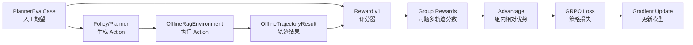

# GRPO 核心代码实现与逐步解析

> 本文是新增的 **GRPO 核心代码实现教程**。它围绕阶段 8.5 的 Reward v1 展开，并说明该 Reward 如何在阶段 9 接入 GRPO。本文不是对 `重构方案.md` 或 `重构方案/阶段8.md` 的替换，也不要求阶段 8 直接开始训练。

## 1. 本文目标

阶段 8.5 表面上是“实现 Reward v1”，但它已经是 GRPO 的核心前置代码，因为 GRPO 训练需要一个稳定、可复现、可解释的奖励函数来判断一条 Planner 轨迹好不好。

本文要完成三件事：

1. 讲清楚 Reward v1 在完整 GRPO 流程中的位置。
2. 给出 `app/rag/evaluation/metrics.py` 和 `app/rag/evaluation/reward.py` 的完整实现代码。
3. 给出阶段 9 可复用的最小 GRPO 训练闭环代码，覆盖样本生成、奖励计算、组内优势估计、损失计算和梯度更新。

阶段边界要明确：

- 阶段 8.5 落地的是 **Reward v1 评分器**，用于评测 rule/api/local baseline。
- 阶段 9 才把同一个 Reward v1 接入 GRPO 训练。
- 本文中的 GRPO 训练闭环代码是教学版核心实现，目的是说明 Reward 如何变成训练信号；真实本地大模型训练时，需要替换其中的教学型 `FiniteActionPathPolicy`。

## 2. Reward v1 在 GRPO 中的位置

当前项目已经有三类关键对象：

- `PlannerEvalCase`：人工标注的题目和期望，里面有 `expected_chunks`、`expected_answer_points`、`expected_behavior`、`acceptable_action_paths`。
- `OfflineRagEnvironment`：固定快照下执行 Planner 的 Action，产出可复现轨迹。
- `OfflineTrajectoryResult`：一条轨迹的实际结果，里面有 `action_path`、`retrieved_candidates`、`citations`、`answer`、`errors`。

Reward v1 做的是把“人工期望”和“实际轨迹”对齐比较：

```text
PlannerEvalCase
  + OfflineTrajectoryResult
  -> Reward v1
  -> 分项分数 + 总分
```

进入阶段 9 后，GRPO 的训练循环会变成：

```text
同一个 case
  -> 当前 Policy 采样多条轨迹
  -> Environment 执行每条轨迹
  -> Reward v1 给每条轨迹打分
  -> 同组内计算 advantage
  -> 用 GRPO loss 更新 Policy
```

用 Mermaid 表示就是：



## 3. 数据如何流转

输入有三层：

1. `case`：来自阶段 8 的 JSONL 样本，表示“应该怎么做”。
2. `trajectory`：由 `OfflineRagEnvironment` 跑出来，表示“实际做了什么”。
3. `reward_config`：Reward 权重、格式错误上限、成本惩罚参数。

中间处理分为六个分项：

- `score_format`：结构化输出和 Action 路径是否合法。
- `score_retrieval`：是否检索到期望 chunk。
- `score_citation`：最终引用是否来自期望证据。
- `score_answer`：回答要点是否覆盖。
- `score_behavior`：是否该答、该拒、该追问、该 Web。
- `score_cost`：是否有不必要的 HyDE/Web、过多步骤和过高成本。

最终输出：

- `TrajectoryReward.total_reward`：GRPO 训练真正使用的标量奖励。
- `TrajectoryReward.components`：每个分项的分数、权重、明细和扣分原因。
- `TrajectoryReward.model_dump(mode="json")`：可以直接写入评测结果 JSON。

## 4. 总体实现思路

Reward v1 不应该一开始就用一个 LLM Judge 黑盒总分。原因是阶段 9 一旦进入训练，如果总分不可解释，很容易出现 reward hacking：模型学会钻规则漏洞，但我们看不出它是在检索、引用、行为还是成本上出了问题。

所以第一版采用“规则优先、LLM Judge 可后补”的设计：

1. `metrics.py` 只放纯指标函数，例如 recall、MRR、nDCG、文本要点覆盖率。
2. `reward.py` 负责把指标变成 Reward 分项，并做总分聚合。
3. 格式非法时总分设置硬上限，例如最多 0.2，避免模型绕过 schema。
4. 不应该回答的 case 不用答案要点评分，避免“正确拒答”因为没有答案要点被误扣分。
5. 不必要 Web/HyDE 同时扣行为分和成本分，避免模型学成“永远多查一遍”。

下面开始逐步实现。

## 5. 第一步：实现 `metrics.py`

### 5.1 当前模块解决什么问题

`metrics.py` 只做纯计算，不知道 Reward 权重，也不关心 GRPO。它回答的是这些问题：

- 检索结果里有没有命中期望 chunk？
- 第一个命中的期望 chunk 排在第几位？
- 排名越靠前是否得分越高？
- 答案文本是否覆盖人工标注的答案要点？
- 实际 Action 路径是否匹配可接受路径？

把这些指标单独拆出来，可以保证阶段 8 评测报告和阶段 9 GRPO 使用同一套底层算法。

### 5.2 完整代码：`app/rag/evaluation/metrics.py`

```python
"""
阶段 8.5 Reward v1 的纯指标函数。

metrics 的中文含义是“指标”。本文件只做确定性计算：把 expected chunk、实际候选、
最终答案和 Action 路径转成可复现的数字。它不读取数据库、不调用模型、不决定权重；
权重和总分聚合放在 reward.py，避免指标层和训练目标耦合。
"""

from __future__ import annotations

import math
import re
from collections.abc import Iterable, Sequence
from typing import Any

from app.rag.evaluation.case_schema import ExpectedChunk
from app.rag.query.contracts import QueryAction, RetrievalCandidate


# 第一部分：统一证据身份。Reward 先把不同来源里的 chunk 表达统一成同一个 key。
# ChunkKey = (document_id, chunk_id, index_version)：三者合起来才能证明“命中的是哪一版证据”。
ChunkKey = tuple[str, str, int]


def expected_chunk_keys(expected_chunks: Sequence[ExpectedChunk]) -> list[ChunkKey]:
    """从人工标注的 expected_chunks 中提取期望证据身份。"""
    return _compact_keys(  # 复用去重逻辑，避免同一个 chunk 被重复标注后重复计分。
        _to_chunk_key(chunk.document_id, chunk.chunk_id, chunk.index_version)  # 每个 ExpectedChunk 都带版本号。
        for chunk in expected_chunks  # 保留人工标注顺序，后续报告更容易对照 case 文件。
    )


def candidate_chunk_keys(candidates: Sequence[RetrievalCandidate]) -> list[ChunkKey]:
    """从实际检索候选中提取本地 chunk 身份，Web 候选会被自动忽略。"""
    return _compact_keys(  # 去重时保留第一次出现的位置，因为 MRR/nDCG 依赖排名。
        _to_chunk_key(candidate.document_id, candidate.chunk_id, candidate.index_version)  # Web 缺少本地身份时返回 None。
        for candidate in candidates  # candidates 通常来自 OfflineTrajectoryResult.retrieved_candidates。
    )


# 第二部分：检索质量指标。score_retrieval 会按这个顺序计算 recall、MRR、nDCG 和标识命中。
def recall_at_k(retrieved_keys: Sequence[ChunkKey], expected_keys: Sequence[ChunkKey], *, k: int) -> float:
    """计算 recall@k：前 k 个候选覆盖了多少期望 chunk。"""
    if not expected_keys:  # 没有 expected chunk 的场景在上层通常是非回答型样本，这里按满分兜底。
        return 1.0
    top_keys = set(retrieved_keys[:max(0, k)])  # k 小于 0 时按 0 处理，避免切片语义产生误会。
    hit_count = sum(1 for key in expected_keys if key in top_keys)  # 逐个 expected chunk 统计是否命中。
    return hit_count / len(expected_keys)  # recall 的分母是期望证据数量，不是检索返回数量。


def reciprocal_rank(retrieved_keys: Sequence[ChunkKey], expected_keys: Sequence[ChunkKey]) -> float:
    """计算 MRR 的单样本 reciprocal rank：第一个期望 chunk 越靠前越高。"""
    expected_set = set(expected_keys)  # set 查询是 O(1)，避免每个候选都线性扫描 expected_keys。
    if not expected_set:  # 没有 expected chunk 时不惩罚检索层。
        return 1.0
    for rank, key in enumerate(retrieved_keys, start=1):  # rank 从 1 开始，符合 MRR 公式 1/rank。
        if key in expected_set:  # 只看第一个命中的期望证据。
            return 1.0 / rank
    return 0.0  # 完全没有命中期望证据时 MRR 为 0。


def ndcg_at_k(retrieved_keys: Sequence[ChunkKey], expected_keys: Sequence[ChunkKey], *, k: int) -> float:
    """计算二值相关性的 nDCG@k：同样命中数量下，越靠前分越高。"""
    if not expected_keys:  # 非回答型或无期望证据样本不在指标层扣分。
        return 1.0
    expected_set = set(expected_keys)  # 第一版只做二值相关性：命中 expected chunk 就是 1，否则 0。
    ranked_keys = retrieved_keys[:max(0, k)]  # 只评价前 k 个候选，和 recall@k 的窗口保持一致。
    dcg = sum(  # DCG：实际排序下的折损累计收益。
        1.0 / math.log2(rank + 1)  # rank 越靠后，log 折损越大。
        for rank, key in enumerate(ranked_keys, start=1)  # rank 从 1 开始，公式分母使用 log2(rank + 1)。
        if key in expected_set  # 非期望 chunk 的相关性为 0，不贡献 DCG。
    )
    ideal_hits = min(len(expected_set), max(0, k))  # 理想排序最多只能命中 min(expected_count, k) 个。
    ideal_dcg = sum(1.0 / math.log2(rank + 1) for rank in range(1, ideal_hits + 1))  # IDCG 是最佳排序分。
    return 0.0 if ideal_dcg == 0 else dcg / ideal_dcg  # 避免 k=0 时除以 0。


def identifier_hit_rate(
        candidates: Sequence[RetrievalCandidate],
        expected_identifiers: dict[str, list[str]],
) -> tuple[float, dict[str, list[str]], dict[str, list[str]]]:
    """计算设备型号、报警码、部件名等结构化标识的命中率。"""
    expected_pairs = _identifier_pairs(expected_identifiers)  # 展平成 [(字段名, 规范化值)]，方便逐个判断。
    if not expected_pairs:  # case 没有标注标识时，不让这个补充指标拖低检索分。
        return 1.0, {}, {}

    hits: dict[str, list[str]] = {}  # 保存已命中的标识，写入 Reward 明细供报告解释。
    misses: dict[str, list[str]] = {}  # 保存未命中的标识，便于定位是设备型号错还是报警码错。
    for identifier_type, expected_value in expected_pairs:  # 每个标识值单独计分，避免一个字段多个值时被合并。
        matched = any(  # 任意候选命中该标识就算这个标识值命中。
            expected_value in _candidate_identifier_text(candidate, identifier_type)  # 在 metadata、标题和正文中查找。
            for candidate in candidates
        )
        target = hits if matched else misses  # 命中和未命中分开放，Reward details 更直观。
        target.setdefault(identifier_type, []).append(expected_value)  # 同一字段下可能有多个期望值。

    hit_count = sum(len(values) for values in hits.values())  # 命中的标识值总数。
    return hit_count / len(expected_pairs), hits, misses  # 返回命中率、命中明细、缺失明细。


# 第三部分：答案和 Action 路径指标。score_answer、score_behavior、score_cost 会调用这里。
def answer_point_coverage(answer: str, expected_answer_points: Sequence[str]) -> tuple[float, list[str], list[str]]:
    """计算答案要点覆盖率，第一版使用可复现的文本包含判断。"""
    if not expected_answer_points:  # 拒答/追问样本没有答案要点，不应在指标层被误扣分。
        return 1.0, [], []

    normalized_answer = normalize_text(answer)  # 统一大小写和空白，减少表面格式差异。
    hit_points: list[str] = []  # 保存已覆盖的人工要点。
    missing_points: list[str] = []  # 保存缺失的人工要点。
    for point in expected_answer_points:  # 每个答案要点独立判断，后续可定位漏了哪一点。
        normalized_point = normalize_text(point)  # 要点同样归一化，和 answer 使用同一规则。
        if normalized_point and normalized_point in normalized_answer:  # 命中时归入 hit_points。
            target = hit_points
        else:  # 未命中或空要点归入 missing_points，便于报告提示缺失项。
            target = missing_points
        target.append(point)  # details 保留原始中文要点，报告更可读。

    return len(hit_points) / len(expected_answer_points), hit_points, missing_points  # 覆盖率 = 命中要点数 / 总要点数。


def action_values(actions: Iterable[QueryAction | str]) -> list[str]:
    """把 QueryAction 或字符串统一成持久化 value，供路径比较和报告输出使用。"""
    return [action.value if isinstance(action, QueryAction) else str(action) for action in actions]  # 保持原顺序，不排序。


def matches_any_action_path(
        actual_path: Sequence[QueryAction | str],
        acceptable_paths: Sequence[Sequence[QueryAction | str]],
) -> bool:
    """判断实际 Action 路径是否完整匹配任意一条人工可接受路径。"""
    actual_values = action_values(actual_path)  # 先把实际路径统一成字符串列表。
    return any(actual_values == action_values(path) for path in acceptable_paths)  # 必须完整相等，不做前缀匹配。


def shortest_acceptable_path_length(acceptable_paths: Sequence[Sequence[QueryAction | str]]) -> int:
    """返回最短可接受路径长度，用于估计额外步骤成本。"""
    lengths = [len(path) for path in acceptable_paths if path]  # 空路径在 schema 层会拒绝，这里仍防御处理。
    return min(lengths) if lengths else 0  # 没有可接受路径时返回 0，让上层自行决定是否扣分。


# 第四部分：内部小工具。放在文件末尾，避免打断上面的实际调用阅读顺序。
def normalize_text(value: Any) -> str:
    """把文本转成适合保守包含匹配的形式。"""
    text = str(value or "").strip().lower()  # None、数字等输入统一转字符串，避免指标函数抛异常。
    return re.sub(r"\s+", "", text)  # 去掉连续空白，让 “HAK 180” 和 “hak180” 可以对齐。


def _to_chunk_key(document_id: str | None, chunk_id: str | int | None, index_version: int | None) -> ChunkKey | None:
    """把本地证据身份转成 ChunkKey；Web 或缺版本证据返回 None。"""
    if not document_id or chunk_id is None or index_version is None:  # 三个字段缺任意一个都不能证明版本化 chunk 身份。
        return None
    return str(document_id), str(chunk_id), int(index_version)  # chunk_id 统一成 str，消除 123 和 "123" 的差异。


def _compact_keys(keys: Iterable[ChunkKey | None]) -> list[ChunkKey]:
    """去掉 None 和重复 key，同时保留首次出现顺序。"""
    compacted: list[ChunkKey] = []  # 输出列表用于保留排名顺序。
    seen: set[ChunkKey] = set()  # seen 用于去重，避免同一 chunk 重复计分。
    for key in keys:  # keys 可能是生成器，所以只能遍历一次。
        if key is None or key in seen:  # None 表示 Web/无效本地身份；重复 key 不再加入。
            continue
        compacted.append(key)  # 第一次出现的位置就是后续排名指标使用的位置。
        seen.add(key)  # 记录已出现，保证去重。
    return compacted


def _identifier_pairs(expected_identifiers: dict[str, list[str]]) -> list[tuple[str, str]]:
    """把 expected_identifiers 展平成可逐个评分的标识对。"""
    return [
        (identifier_type, normalized_value)  # 保留字段名，Reward 明细能说明是哪个标识没命中。
        for identifier_type, values in expected_identifiers.items()  # 例如 equipment_model、alarm_code、part_name。
        for normalized_value in [normalize_text(value) for value in values]  # 每个值都使用同一套文本归一化。
        if normalized_value  # 空值不参与评分，schema 正常情况下也会清理空值。
    ]


def _candidate_identifier_text(candidate: RetrievalCandidate, identifier_type: str) -> str:
    """拼出候选证据中可用于标识匹配的文本。"""
    metadata_value = getattr(candidate, identifier_type, None)  # 优先使用候选 metadata 中的结构化字段。
    return normalize_text(f"{metadata_value or ''} {candidate.title} {candidate.content}")  # 标题和正文作为兜底匹配来源。
```


## 6. 第二步：实现 `reward.py`

### 6.1 当前模块解决什么问题

`reward.py` 把 `metrics.py` 的指标变成可用于评测和 GRPO 的奖励。

它要解决三类工程问题：

1. **分项可解释**：每个分数都要有明细，不能只有一个总分。
2. **总分可控**：格式非法时必须有硬上限，防止模型绕过 Action schema。
3. **行为边界正确**：拒答/追问 case 不应该因为没有答案要点而被误判。

### 6.2 核心变量说明

- `RewardComponent`：一个分项奖励，例如 `retrieval` 或 `cost`。
- `RewardWeights`：各分项权重。
- `RewardConfig`：Reward 版本和硬上限配置。
- `TrajectoryReward`：一条轨迹最终的 Reward 输出，可 JSON 序列化。
- `score_trajectory`：主入口，阶段 8 评测和阶段 9 GRPO 都调用它。

### 6.3 完整代码：`app/rag/evaluation/reward.py`

```python
"""
阶段 8.5 Reward v1。

Reward 的中文含义是“奖励/评分信号”。阶段 8 中它用于离线评测，阶段 9 中同一套
score_trajectory 会作为 GRPO 的训练奖励。第一版优先使用可执行、可复现的规则指标；
LLM Judge 只能作为后续补充分项，不能替代这些基础规则。
"""

from __future__ import annotations

from typing import Any, Callable

from pydantic import BaseModel, ConfigDict, Field, model_validator

from app.rag.evaluation.case_schema import PlannerEvalCase
from app.rag.evaluation.metrics import (
    action_values,
    answer_point_coverage,
    candidate_chunk_keys,
    expected_chunk_keys,
    identifier_hit_rate,
    matches_any_action_path,
    ndcg_at_k,
    recall_at_k,
    reciprocal_rank,
    shortest_acceptable_path_length,
)
from app.rag.evaluation.offline_environment import OfflineTrajectoryResult, OfflineTrajectoryStatus
from app.rag.query.contracts import EvidenceSourceType, QueryAction


# 第一部分：版本和硬边界常量。score_trajectory 会先用这些常量判断轨迹是否可训练。
REWARD_VERSION = "reward-v1"  # Reward 版本必须写入结果文件；权重或规则变化时要升级。
TERMINAL_ACTIONS = {QueryAction.ANSWER, QueryAction.ASK_CLARIFICATION, QueryAction.REFUSE}  # 合法终态集合。
FORMAT_ERROR_CODES = {  # 这些错误代表 Planner 输出或 Action 路径不合法，会触发总分上限。
    "unknown_action",
    "planner_output_invalid",
    "action_not_allowed",
    "illegal_action_transition",
    "duplicated_retrieval_action",
    "terminal_state_already_reached",
    "no_terminal_action",
    "max_steps_exceeded",
}


# 第二部分：Reward 输出 schema。先定义数据形状，再定义评分入口。
class RewardModel(BaseModel):
    """Reward schema 公共基类，拒绝未知字段，避免评测结果悄悄漂移。"""

    model_config = ConfigDict(extra="forbid", validate_assignment=True)  # 修改字段时也触发 Pydantic 校验。


class RewardComponent(RewardModel):
    """一个可解释 Reward 分项，例如 format、retrieval、citation、answer、behavior、cost。"""

    name: str = Field(min_length=1, description="分项名称，必须和聚合权重中的 key 对齐。")
    score: float = Field(ge=0, le=1, description="0～1 原始分项分，尚未除以总权重。")
    weight: float = Field(ge=0, description="该分项参与总分的权重；允许为 0 以便临时关闭。")
    weighted_score: float = Field(ge=0, description="score * weight，聚合总分时直接相加。")
    details: dict[str, Any] = Field(default_factory=dict, description="机器可读明细，用于报告和排查。")
    reasons: list[str] = Field(default_factory=list, description="中文解释，说明扣分或特殊处理原因。")


class RewardWeights(RewardModel):
    """Reward v1 分项权重；第一版同时约束答案质量、证据质量、行为和成本。"""

    format: float = Field(default=0.15, ge=0, description="结构化格式和 Action 合法性权重。")
    retrieval: float = Field(default=0.25, ge=0, description="expected chunk 召回、排序和标识命中权重。")
    citation: float = Field(default=0.15, ge=0, description="最终 Citation 是否引用期望/有效 chunk 的权重。")
    answer: float = Field(default=0.20, ge=0, description="答案要点覆盖或拒答/追问终态正确性的权重。")
    behavior: float = Field(default=0.15, ge=0, description="是否该答、该拒、该追问、该 Web 的行为权重。")
    cost: float = Field(default=0.10, ge=0, description="不必要 HyDE/Web、额外步骤和耗时的成本权重。")

    def as_dict(self) -> dict[str, float]:
        """按 score 函数名称返回权重，score_trajectory 用它统一聚合。"""
        return {  # dict 的 key 与 components 的 key 保持一致，避免聚合时手写多套名字。
            "format": self.format,
            "retrieval": self.retrieval,
            "citation": self.citation,
            "answer": self.answer,
            "behavior": self.behavior,
            "cost": self.cost,
        }


class RewardConfig(RewardModel):
    """Reward v1 运行配置，集中保存版本、权重和硬上限。"""

    reward_version: str = Field(default=REWARD_VERSION, description="Reward 版本，写入每条评测结果。")
    weights: RewardWeights = Field(default_factory=RewardWeights, description="六个分项的聚合权重。")
    retrieval_top_k: int = Field(default=10, ge=1, description="recall@k 和 nDCG@k 使用的 k。")
    invalid_format_cap: float = Field(default=0.20, ge=0, le=1, description="格式非法时总分上限。")
    failed_trajectory_cap: float = Field(default=0.30, ge=0, le=1, description="环境执行失败但非格式错误时总分上限。")
    unnecessary_hyde_penalty: float = Field(default=0.20, ge=0, le=1, description="不必要 HyDE 的成本扣分。")
    unnecessary_web_penalty: float = Field(default=0.30, ge=0, le=1, description="不必要 Web 的成本扣分。")
    extra_step_penalty: float = Field(default=0.08, ge=0, le=1, description="每个额外 Action 步骤的成本扣分。")

    @model_validator(mode="after")
    def validate_weights(self) -> "RewardConfig":
        """保证至少有一个分项参与总分，否则 GRPO 没有可优化目标。"""
        if sum(self.weights.as_dict().values()) <= 0:  # 权重全为 0 会导致除以 0，也没有训练意义。
            raise ValueError("Reward 权重总和必须大于 0")
        return self


class TrajectoryReward(RewardModel):
    """一条轨迹的最终 Reward 输出；total_reward 是 GRPO 真正使用的标量。"""

    reward_version: str = Field(description="本次评分使用的 Reward 版本。")
    total_reward: float = Field(ge=0, le=1, description="应用格式/失败上限后的最终奖励。")
    raw_total_reward: float = Field(ge=0, le=1, description="应用硬上限前的加权总分。")
    capped_by: str | None = Field(default=None, description="触发的总分上限原因，例如 invalid_format。")
    format_valid: bool = Field(description="Planner 输出和 Action 路径是否通过格式校验。")
    components: dict[str, RewardComponent] = Field(description="所有分项奖励，必须随总分一起保存。")
    errors: list[dict[str, Any]] = Field(default_factory=list, description="离线环境返回的结构化错误。")

    def to_json_dict(self) -> dict[str, Any]:
        """返回可直接写入 PlannerEvalResult.reward 的 JSON 字典。"""
        return self.model_dump(mode="json")  # mode=json 会把 Enum 等对象转成可序列化值。


# 第三部分：主入口。阶段 8 评测和阶段 9 GRPO 都应该只从 score_trajectory 进入。
ScoreFn = Callable[[PlannerEvalCase, OfflineTrajectoryResult, RewardConfig], RewardComponent]


def score_trajectory(
        case: PlannerEvalCase,
        trajectory: OfflineTrajectoryResult,
        config: RewardConfig | None = None,
) -> TrajectoryReward:
    """对一条 OfflineTrajectoryResult 计算 Reward v1。"""
    active_config = config or RewardConfig()  # 调用方不传配置时使用 v1 默认权重。
    score_functions: tuple[ScoreFn, ...] = (  # 按实际评估顺序排列，方便阅读和排查。
        score_format,
        score_retrieval,
        score_citation,
        score_answer,
        score_behavior,
        score_cost,
    )
    components = {  # 逐个执行分项评分，分项名称来自 RewardComponent.name。
        component.name: component
        for component in (fn(case, trajectory, active_config) for fn in score_functions)
    }
    raw_total = _weighted_average(components, active_config.weights.as_dict())  # 先算不带硬上限的加权分。
    format_valid = not _has_format_error(trajectory)  # 格式是否有效会决定是否触发 invalid_format_cap。
    total, capped_by = _apply_total_cap(raw_total, format_valid, trajectory, active_config)  # 应用总分硬上限。

    return TrajectoryReward(  # 输出对象必须能 JSON 序列化，并保留所有分项明细。
        reward_version=active_config.reward_version,
        total_reward=total,
        raw_total_reward=raw_total,
        capped_by=capped_by,
        format_valid=format_valid,
        components=components,
        errors=[error.model_dump(mode="json") for error in trajectory.errors],
    )


# 第四部分：分项 1，格式分。先检查格式，是为了尽早发现 GRPO 可能学会绕过 schema 的问题。
def score_format(case: PlannerEvalCase, trajectory: OfflineTrajectoryResult, config: RewardConfig) -> RewardComponent:
    """评分结构化格式和 Action 合法性，不判断答案内容。"""
    _ = case  # 格式分只依赖实际轨迹；保留 case 参数是为了所有 score 函数签名一致。
    score = 1.0  # 默认满分，再按错误扣分。
    reasons: list[str] = []  # 扣分原因写入报告，便于定位非法 Action。
    format_error_codes = _error_codes(trajectory, FORMAT_ERROR_CODES)  # 只抽取会触发格式上限的错误码。

    if trajectory.terminal_action not in TERMINAL_ACTIONS:  # 没有合法终态，说明轨迹不能作为训练正样本。
        score -= 0.35
        reasons.append("轨迹没有到达 answer/refuse/ask_clarification 终态")
    if format_error_codes:  # 出现非法 Action、解析失败、重复检索等问题。
        score -= 0.65
        reasons.append(f"存在格式或 Action 合法性错误：{format_error_codes}")
    if not trajectory.action_path:  # 空路径无法复盘，也无法计算行为和成本。
        score -= 0.20
        reasons.append("Action 路径为空，无法复盘 Planner 决策")

    return _component(  # 使用统一构造器，保证分数被 clamp 到 0～1。
        name="format",
        score=score,
        weight=config.weights.format,
        details={
            "terminal_action": _action_name(trajectory.terminal_action),
            "action_path": action_values(trajectory.action_path),
            "format_error_codes": format_error_codes,
        },
        reasons=reasons,
    )


# 第五部分：分项 2，检索分。回答型 case 才要求命中 expected_chunks。
def score_retrieval(case: PlannerEvalCase, trajectory: OfflineTrajectoryResult, config: RewardConfig) -> RewardComponent:
    """评分 expected chunk 召回、排序质量和结构化标识命中。"""
    if not case.expected_behavior.should_answer:  # 拒答/追问样本没有证据命中要求。
        return _component("retrieval", 1.0, config.weights.retrieval, {"not_applicable": True}, ["非回答型样本不要求命中 expected_chunks"])

    expected_keys = expected_chunk_keys(case.expected_chunks)  # 人工期望证据身份。
    retrieved_keys = candidate_chunk_keys(trajectory.retrieved_candidates)  # 实际本地候选身份。
    recall = recall_at_k(retrieved_keys, expected_keys, k=config.retrieval_top_k)  # 是否找全 expected chunk。
    mrr = reciprocal_rank(retrieved_keys, expected_keys)  # 第一个 expected chunk 是否靠前。
    ndcg = ndcg_at_k(retrieved_keys, expected_keys, k=config.retrieval_top_k)  # 多个 expected chunk 的整体排序。
    identifier_rate, identifier_hits, identifier_misses = identifier_hit_rate(  # 设备型号/报警码命中情况。
        trajectory.retrieved_candidates,
        case.expected_identifiers,
    )
    score = 0.40 * recall + 0.25 * mrr + 0.25 * ndcg + 0.10 * identifier_rate  # 保持 v1 核心加权公式不变。
    reasons: list[str] = []  # 检索扣分原因。

    if recall < 1:  # 有 required/supporting chunk 没被找出来。
        reasons.append("未完全召回 expected_chunks")
    if identifier_misses:  # 标识没命中通常意味着设备型号或报警码风险。
        reasons.append("部分设备型号、报警码或部件标识未命中")
    if trajectory.corpus_match_status != "match":  # 语料快照不一致时，检索结果不可完全信任。
        score = min(score, 0.40)
        reasons.append("轨迹语料与 environment snapshot 不匹配，检索分设置上限")

    return _component(
        name="retrieval",
        score=score,
        weight=config.weights.retrieval,
        details={
            "recall_at_k": recall,
            "mrr": mrr,
            "ndcg_at_k": ndcg,
            "identifier_hit_rate": identifier_rate,
            "identifier_hits": identifier_hits,
            "identifier_misses": identifier_misses,
            "expected_chunk_count": len(expected_keys),
            "retrieved_chunk_count": len(retrieved_keys),
            "top_k": config.retrieval_top_k,
        },
        reasons=reasons,
    )


# 第六部分：分项 3，引用分。答案不仅要检索对，还要引用对。
def score_citation(case: PlannerEvalCase, trajectory: OfflineTrajectoryResult, config: RewardConfig) -> RewardComponent:
    """评分最终 Citation 是否指向 expected chunk。"""
    if not case.expected_behavior.should_answer:  # 非回答型样本通常不应产生引用。
        score = 1.0 if not trajectory.citations else 0.40
        reasons = [] if not trajectory.citations else ["非回答型样本不应生成最终引用"]
        return _component(
            "citation",
            score,
            config.weights.citation,
            {"citation_count": len(trajectory.citations), "not_applicable": True},
            reasons,
        )

    hit_rate, expected_count, citation_count, invalid_count = _citation_stats(case, trajectory)  # 统计引用命中和无效引用。
    score = min(hit_rate, 0.60) if invalid_count else hit_rate  # 出现无法映射版本的引用时设置上限。
    reasons: list[str] = []  # 引用扣分原因。
    if hit_rate < 1:
        reasons.append("最终 Citation 没有完全覆盖 expected_chunks")
    if invalid_count:
        reasons.append("存在无法映射到本地 chunk/index_version 的引用")

    return _component(
        name="citation",
        score=score,
        weight=config.weights.citation,
        details={
            "citation_hit_rate": hit_rate,
            "expected_chunk_count": expected_count,
            "citation_chunk_count": citation_count,
            "invalid_citation_count": invalid_count,
        },
        reasons=reasons,
    )


# 第七部分：分项 4，答案分。拒答/追问样本只看终态，不看答案要点覆盖。
def score_answer(case: PlannerEvalCase, trajectory: OfflineTrajectoryResult, config: RewardConfig) -> RewardComponent:
    """评分最终交付文本或拒答/追问终态。"""
    if not case.expected_behavior.should_answer:  # 拒答和追问没有 expected_answer_points，不应套回答型评分。
        expected_terminal = _expected_terminal_action(case)
        score = 1.0 if trajectory.terminal_action == expected_terminal else 0.0
        return _component(
            name="answer",
            score=score,
            weight=config.weights.answer,
            details={"expected_terminal": expected_terminal.value, "not_applicable_answer_points": True},
            reasons=[] if score == 1.0 else ["非回答型样本的终态行为不符合 expected_behavior"],
        )

    coverage, hit_points, missing_points = answer_point_coverage(trajectory.answer, case.expected_answer_points)  # 文本要点覆盖率。
    score = coverage if trajectory.terminal_action == QueryAction.ANSWER else 0.0  # 没到 answer 终态时答案分归零。
    reasons = [] if not missing_points else ["答案缺少部分 expected_answer_points"]
    if trajectory.terminal_action != QueryAction.ANSWER:
        reasons.append("回答型样本没有到达 answer 终态")

    return _component(
        name="answer",
        score=score,
        weight=config.weights.answer,
        details={
            "answer_point_coverage": coverage,
            "hit_points": hit_points,
            "missing_points": missing_points,
            "answer_length": len(trajectory.answer),
        },
        reasons=reasons,
    )


# 第八部分：分项 5，行为分。判断路线是否符合人工标注的业务预期。
def score_behavior(case: PlannerEvalCase, trajectory: OfflineTrajectoryResult, config: RewardConfig) -> RewardComponent:
    """评分该答/拒/追问/Web 的行为是否符合 expected_behavior。"""
    actual_path = action_values(trajectory.action_path)  # 实际路径转成字符串，便于集合和报告处理。
    expected_terminal = _expected_terminal_action(case)  # 从 should_answer/refuse/ask 映射出期望终态。
    terminal_match = trajectory.terminal_action == expected_terminal  # 终态是否正确。
    path_match = matches_any_action_path(trajectory.action_path, case.acceptable_action_paths)  # 路径是否属于人工可接受路线。
    forbidden_used = sorted(  # 实际使用的禁用 Action。
        set(action_values(case.expected_behavior.forbidden_actions)).intersection(actual_path)
    )
    used_web = QueryAction.WEB_SEARCH.value in actual_path  # 是否使用 Web fallback。
    score = (  # 保持 v1 行为分公式。
        (0.60 if terminal_match else 0.0)
        + (0.20 if path_match else 0.0)
        + (0.10 if not forbidden_used else 0.0)
        + (0.10 if used_web == case.expected_behavior.should_call_web else 0.0)
    )
    reasons: list[str] = []  # 行为扣分原因。

    if not terminal_match:
        reasons.append(
            "终态行为不符合 expected_behavior："
            f"expected={expected_terminal.value}, actual={_action_name(trajectory.terminal_action)}"
        )
    if not path_match:
        reasons.append("实际 Action 路径不在 acceptable_action_paths 中")
    if forbidden_used:
        reasons.append(f"使用了 forbidden_actions：{forbidden_used}")
    if used_web != case.expected_behavior.should_call_web:
        reasons.append("Web fallback 使用状态与 expected_behavior.should_call_web 不一致")

    return _component(
        name="behavior",
        score=score,
        weight=config.weights.behavior,
        details={
            "expected_terminal": expected_terminal.value,
            "actual_terminal": _action_name(trajectory.terminal_action),
            "path_match": path_match,
            "forbidden_used": forbidden_used,
            "should_call_web": case.expected_behavior.should_call_web,
            "used_web": used_web,
        },
        reasons=reasons,
    )


# 第九部分：分项 6，成本分。防止模型为了保险而永远多走 HyDE/Web。
def score_cost(case: PlannerEvalCase, trajectory: OfflineTrajectoryResult, config: RewardConfig) -> RewardComponent:
    """评分不必要 HyDE/Web、额外步骤和耗时。"""
    actual_path = action_values(trajectory.action_path)  # 成本分只关心实际执行过哪些 Action。
    acceptable_values = [action_values(path) for path in case.acceptable_action_paths]  # 人工可接受路径转成字符串。
    shortest_len = shortest_acceptable_path_length(case.acceptable_action_paths)  # 最短可接受路径作为额外步骤基准。
    extra_steps = max(0, len(actual_path) - shortest_len) if shortest_len else 0  # 没有基准时不按步数扣分。
    score = 1.0  # 成本默认满分，再按不必要动作扣分。
    reasons: list[str] = []  # 成本扣分原因。

    if extra_steps:
        score -= min(0.40, extra_steps * config.extra_step_penalty)  # 额外步数扣分设置上限，避免成本分吞掉全部质量信号。
        reasons.append(f"Action 步数比最短可接受路径多 {extra_steps} 步")
    if QueryAction.HYDE_SEARCH.value in actual_path and not any(
        QueryAction.HYDE_SEARCH.value in path
        for path in acceptable_values
    ):
        score -= config.unnecessary_hyde_penalty
        reasons.append("使用了不必要的 HyDE 检索")
    if QueryAction.WEB_SEARCH.value in actual_path and not case.expected_behavior.should_call_web:
        score -= config.unnecessary_web_penalty
        reasons.append("使用了不必要的 Web 检索")

    return _component(
        name="cost",
        score=score,
        weight=config.weights.cost,
        details={
            "action_count": len(actual_path),
            "shortest_acceptable_path_length": shortest_len,
            "extra_steps": extra_steps,
            "used_hyde": QueryAction.HYDE_SEARCH.value in actual_path,
            "used_web": QueryAction.WEB_SEARCH.value in actual_path,
            "total_duration_ms": sum(step.duration_ms for step in trajectory.trace_steps),
        },
        reasons=reasons,
    )


# 第十部分：内部工具。放在最后，保持主入口和六个分项的阅读顺序连贯。
def _weighted_average(components: dict[str, RewardComponent], weights: dict[str, float]) -> float:
    """按权重聚合所有分项，返回应用硬上限前的 raw_total_reward。"""
    total_weight = sum(weights.values())  # 权重总和已在 RewardConfig 中保证大于 0。
    weighted_sum = sum(components[name].weighted_score for name in weights)  # 只聚合权重表声明的分项。
    return _clamp01(weighted_sum / total_weight)  # 归一化到 0～1，便于 GRPO 直接使用。


def _apply_total_cap(
        raw_total: float,
        format_valid: bool,
        trajectory: OfflineTrajectoryResult,
        config: RewardConfig,
) -> tuple[float, str | None]:
    """应用格式非法和环境失败的总分上限。"""
    if not format_valid:  # 格式非法优先级最高，防止模型通过非法输出拿高分。
        return min(raw_total, config.invalid_format_cap), "invalid_format"
    if trajectory.status == OfflineTrajectoryStatus.FAILED:  # 非格式错误的执行失败也不能拿满分。
        return min(raw_total, config.failed_trajectory_cap), "failed_trajectory"
    return raw_total, None  # 正常完成时不设置 capped_by。


def _expected_terminal_action(case: PlannerEvalCase) -> QueryAction:
    """把 expected_behavior 三选一终态映射成 QueryAction。"""
    if case.expected_behavior.should_answer:
        return QueryAction.ANSWER
    if case.expected_behavior.should_refuse:
        return QueryAction.REFUSE
    return QueryAction.ASK_CLARIFICATION


def _has_format_error(trajectory: OfflineTrajectoryResult) -> bool:
    """判断是否存在会触发 invalid_format_cap 的格式错误。"""
    return trajectory.terminal_action not in TERMINAL_ACTIONS or bool(_error_codes(trajectory, FORMAT_ERROR_CODES))


def _error_codes(trajectory: OfflineTrajectoryResult, selected_codes: set[str]) -> list[str]:
    """从 OfflineError 列表中抽取指定错误码。"""
    return [error.code for error in trajectory.errors if error.code in selected_codes]


def _citation_stats(case: PlannerEvalCase, trajectory: OfflineTrajectoryResult) -> tuple[float, int, int, int]:
    """统计 Citation 命中率、期望数量、有效引用数量和无效引用数量。"""
    expected_keys = set(expected_chunk_keys(case.expected_chunks))  # 期望引用命中的本地 chunk 集合。
    citation_keys: set[tuple[str, str, int]] = set()  # 实际可映射到版本化本地 chunk 的引用集合。
    invalid_count = 0  # Web 引用、缺 document/chunk、缺 index_version 都算无效引用。

    for citation in trajectory.citations:
        if citation.source_type != EvidenceSourceType.LOCAL or citation.document_id is None or citation.chunk_id is None:
            invalid_count += 1
            continue
        index_version = case.source_index_versions.get(citation.document_id)  # Citation 无 index_version，需要从 case 文档版本补齐。
        if index_version is None:
            invalid_count += 1
            continue
        citation_keys.add((citation.document_id, str(citation.chunk_id), int(index_version)))

    hit_count = sum(1 for key in expected_keys if key in citation_keys)  # expected chunk 被引用覆盖的数量。
    hit_rate = 1.0 if not expected_keys else hit_count / len(expected_keys)  # 没有 expected chunk 时不在这里扣分。
    return hit_rate, len(expected_keys), len(citation_keys), invalid_count


def _component(name: str, score: float, weight: float, details: dict[str, Any], reasons: list[str]) -> RewardComponent:
    """统一构造 RewardComponent，避免每个分项重复 clamp 和 weighted_score 逻辑。"""
    normalized_score = _clamp01(score)  # 扣分后可能小于 0，或者分项加分后超过 1，都要收敛。
    return RewardComponent(
        name=name,
        score=normalized_score,
        weight=weight,
        weighted_score=normalized_score * weight,
        details=details,
        reasons=reasons,
    )


def _action_name(action: QueryAction | None) -> str | None:
    """把可选 Action 转成可写 JSON 的字符串。"""
    return action.value if action else None


def _clamp01(value: float) -> float:
    """把任意浮点分数限制在 0～1。"""
    return max(0.0, min(1.0, float(value)))
```


## 7. 第三步：阶段 8 调用方式

### 7.1 当前模块如何与前后模块衔接

阶段 8 的调用链很短：

```text
load case
  -> OfflineRagEnvironment.run_action_path/run_planner
  -> score_trajectory
  -> 写入 PlannerEvalResult.reward
```

调用示例：

```python
from app.rag.evaluation.reward import score_trajectory
from app.rag.evaluation.offline_environment import OfflineRagEnvironment
from app.rag.query.contracts import QueryAction


env = OfflineRagEnvironment(snapshot=snapshot, action_provider=provider)

trajectory = env.run_action_path(
    case,
    [QueryAction.LOCAL_SEARCH, QueryAction.ANSWER],
    run_id="stage8_reward_demo",
)

reward = score_trajectory(case, trajectory)

print(reward.total_reward)
print(reward.components["retrieval"].details)
print(reward.to_json_dict())
```

这里 `reward.to_json_dict()` 可以直接写入 `PlannerEvalResult.reward`。

## 8. 第四步：GRPO 教学版最小训练闭环

### 8.1 为什么还需要这段代码

上面的 `reward.py` 只能打分，还不是训练。GRPO 训练至少还需要五步：

1. 样本生成：同一个 case 采样多条轨迹。
2. 奖励计算：每条轨迹调用 `score_trajectory`。
3. 组内优势估计：同一个 case 内，高于组均值的轨迹 advantage 为正。
4. 损失计算：用 clipping 控制策略更新幅度。
5. 梯度更新：反向传播并更新模型参数。

真实阶段 9 会把 `FiniteActionPathPolicy` 替换成本地 Planner 模型。这里先用一个有限 Action 路径策略做教学闭环，目的是让 GRPO 的核心公式和数据流能完整运行。

### 8.2 核心张量形状

假设每个 case 采样 `G` 条轨迹：

- `rewards`: `[G]`，每条轨迹的 Reward 标量。
- `advantages`: `[G]`，组内归一化优势。
- `old_log_probs`: `[G]`，采样时策略给该轨迹的 log probability。
- `new_log_probs`: `[G]`，当前策略重新计算该轨迹的 log probability。
- `ref_log_probs`: `[G]`，参考策略的 log probability，用于 KL 约束。

GRPO 的核心目标可以写成：

```text
ratio = exp(new_log_prob - old_log_prob)
loss_policy = -mean(min(ratio * advantage, clip(ratio) * advantage))
loss = loss_policy + beta * KL(policy || reference)
```

### 8.3 完整代码：`evaluation/stage9/grpo_core_teaching.py`

```python
"""
GRPO 核心训练闭环教学版。

这份代码用于解释阶段 9 如何把阶段 8.5 Reward v1 接入训练。它使用有限 Action 路径
策略代替真实本地大模型：每个 case 从若干候选路径中采样一条，然后由
OfflineRagEnvironment 执行，再用 score_trajectory 得到 reward。

真实训练时要替换 FiniteActionPathPolicy：
- sample_group 对应本地 Planner 模型生成多条 Action JSON；
- log_prob 对应模型对已生成 token 的 log probability 求和；
- ref_log_prob 对应冻结参考模型的 log probability。
"""

from __future__ import annotations

import math
import uuid
from dataclasses import dataclass
from typing import Sequence

import torch
from torch import nn
from torch.distributions import Categorical

from app.rag.evaluation.case_schema import PlannerEvalCase
from app.rag.evaluation.offline_environment import OfflineRagEnvironment, OfflineTrajectoryResult
from app.rag.evaluation.reward import RewardConfig, TrajectoryReward, score_trajectory
from app.rag.query.contracts import QueryAction


DEFAULT_ACTION_PATHS: list[list[QueryAction]] = [
    [QueryAction.LOCAL_SEARCH, QueryAction.ANSWER],
    [QueryAction.LOCAL_SEARCH, QueryAction.HYDE_SEARCH, QueryAction.ANSWER],
    [QueryAction.WEB_SEARCH, QueryAction.ANSWER],
    [QueryAction.LOCAL_SEARCH, QueryAction.ASK_CLARIFICATION],
    [QueryAction.LOCAL_SEARCH, QueryAction.REFUSE],
    [QueryAction.ASK_CLARIFICATION],
    [QueryAction.REFUSE],
]


@dataclass(frozen=True, slots=True)
class RolloutSample:
    """
    一条采样轨迹的训练侧记录。

    path_index 是有限路径策略选中的候选路径编号；actions 是真正交给 Environment 执行的
    Action 序列；old_log_prob 是采样瞬间的策略概率，GRPO loss 要用它计算 ratio。
    """

    case_id: str
    path_index: int
    actions: list[QueryAction]
    old_log_prob: torch.Tensor
    ref_log_prob: torch.Tensor


@dataclass(frozen=True, slots=True)
class ScoredRollout:
    """
    一条已经执行并打分的轨迹。

    reward.total_reward 是训练标量；trajectory 和 reward 明细保留下来，是为了后续生成
    评测报告或排查为什么某个样本 advantage 很高/很低。
    """

    sample: RolloutSample
    trajectory: OfflineTrajectoryResult
    reward: TrajectoryReward
    advantage: torch.Tensor


class FiniteActionPathPolicy(nn.Module):
    """
    教学用有限 Action 路径策略。

    它不是最终要训练的本地大模型，只是用一个可微参数矩阵模拟“模型更偏好哪条路径”。
    logits 的形状是 [case_count, path_count]：
    - 每一行对应一个 case；
    - 每一列对应一条候选 Action path；
    - softmax(logits[row]) 得到该 case 下采样各路径的概率。
    """

    def __init__(
            self,
            *,
            case_ids: Sequence[str],
            action_paths: Sequence[Sequence[QueryAction]] | None = None,
    ) -> None:
        super().__init__()
        if not case_ids:
            raise ValueError("case_ids 不能为空")
        self.case_to_row = {case_id: index for index, case_id in enumerate(case_ids)}
        self.action_paths = [list(path) for path in (action_paths or DEFAULT_ACTION_PATHS)]
        if not self.action_paths:
            raise ValueError("action_paths 不能为空")

        # logits 是唯一可训练参数。真实模型里，这里会换成 Transformer 的全部可训练参数。
        self.logits = nn.Parameter(torch.zeros(len(self.case_to_row), len(self.action_paths)))

    def sample_group(self, case_id: str, *, group_size: int) -> list[RolloutSample]:
        """
        为同一个 case 采样一组轨迹。

        group_size 就是 GRPO 的组大小 G。G 越大，组内相对比较越稳定，但一次训练要跑的
        Environment 轨迹也越多。
        """
        if group_size <= 0:
            raise ValueError("group_size 必须大于 0")

        row = self._case_row(case_id)
        distribution = Categorical(logits=self.logits[row])
        sampled_indices = distribution.sample((group_size,))
        old_log_probs = distribution.log_prob(sampled_indices).detach()

        # 教学版用均匀分布作为 reference policy。真实 GRPO 中，reference 通常是冻结的
        # SFT 模型，用来约束新策略不要偏离太快。
        uniform_ref_log_prob = -math.log(len(self.action_paths))
        ref_log_probs = torch.full_like(old_log_probs, fill_value=uniform_ref_log_prob)

        samples: list[RolloutSample] = []
        for index, old_log_prob, ref_log_prob in zip(sampled_indices, old_log_probs, ref_log_probs, strict=True):
            path_index = int(index.item())
            samples.append(RolloutSample(
                case_id=case_id,
                path_index=path_index,
                actions=list(self.action_paths[path_index]),
                old_log_prob=old_log_prob,
                ref_log_prob=ref_log_prob,
            ))
        return samples

    def log_prob(self, case_id: str, path_indices: torch.Tensor) -> torch.Tensor:
        """
        用当前策略重新计算已采样路径的 log probability。

        path_indices 的形状是 [G]。返回值也是 [G]。GRPO 用 new_log_prob 和
        old_log_prob 的差计算 ratio，从而限制一次更新不能过猛。
        """
        row = self._case_row(case_id)
        distribution = Categorical(logits=self.logits[row])
        return distribution.log_prob(path_indices)

    def _case_row(self, case_id: str) -> int:
        try:
            return self.case_to_row[case_id]
        except KeyError as exc:
            raise KeyError(f"未知 case_id：{case_id}") from exc


def compute_group_advantages(rewards: torch.Tensor, *, eps: float = 1e-6) -> torch.Tensor:
    """
    计算 GRPO 的组内 advantage。

    rewards 形状是 [G]。同一个 case 的 G 条轨迹共享同一个问题，因此可以用组内均值
    做 baseline：高于均值为正，低于均值为负。std 很小时返回 0，避免除以接近 0 的数。
    """
    if rewards.ndim != 1:
        raise ValueError("rewards 必须是一维张量，形状为 [group_size]")
    mean = rewards.mean()
    std = rewards.std(unbiased=False)
    if float(std.item()) < eps:
        return torch.zeros_like(rewards)
    return (rewards - mean) / (std + eps)


def grpo_loss(
        *,
        new_log_probs: torch.Tensor,
        old_log_probs: torch.Tensor,
        ref_log_probs: torch.Tensor,
        advantages: torch.Tensor,
        clip_epsilon: float = 0.2,
        kl_beta: float = 0.02,
) -> torch.Tensor:
    """
    计算一组轨迹的 GRPO loss。

    四个输入张量形状都必须是 [G]。old_log_probs 和 ref_log_probs 不参与梯度；
    new_log_probs 来自当前策略，需要反向传播。
    """
    if not (
        new_log_probs.shape
        == old_log_probs.shape
        == ref_log_probs.shape
        == advantages.shape
    ):
        raise ValueError("new/old/ref log_probs 和 advantages 的形状必须一致")

    # ratio 表示新策略相对采样时旧策略，对同一条轨迹概率放大了多少。
    ratio = torch.exp(new_log_probs - old_log_probs.detach())

    # clipping 是 GRPO/PPO 类算法的稳定器：advantage 为正时不允许过度放大，advantage
    # 为负时不允许过度压低，避免一次 batch 把策略推偏。
    unclipped_objective = ratio * advantages
    clipped_ratio = torch.clamp(ratio, min=1.0 - clip_epsilon, max=1.0 + clip_epsilon)
    clipped_objective = clipped_ratio * advantages
    policy_loss = -torch.minimum(unclipped_objective, clipped_objective).mean()

    # 这是常用的非负近似 KL：exp(ref - new) - (ref - new) - 1。
    # 教学版用被采样路径上的 log_prob 估计；真实大模型训练通常在 token 级别计算。
    log_ratio_to_ref = ref_log_probs.detach() - new_log_probs
    approx_kl = (torch.exp(log_ratio_to_ref) - log_ratio_to_ref - 1.0).mean()

    return policy_loss + kl_beta * approx_kl


def run_one_grpo_step(
        *,
        policy: FiniteActionPathPolicy,
        optimizer: torch.optim.Optimizer,
        env: OfflineRagEnvironment,
        cases: Sequence[PlannerEvalCase],
        group_size: int = 4,
        reward_config: RewardConfig | None = None,
        clip_epsilon: float = 0.2,
        kl_beta: float = 0.02,
) -> dict[str, float]:
    """
    执行一次完整 GRPO 更新。

    这一步覆盖：
    1. 对每个 case 采样 group_size 条路径；
    2. Environment 执行路径得到 trajectory；
    3. Reward v1 给 trajectory 打分；
    4. 同 case 组内计算 advantage；
    5. 累加 GRPO loss 并反向传播更新 policy。
    """
    if not cases:
        raise ValueError("cases 不能为空")

    reward_config = reward_config or RewardConfig()
    all_losses: list[torch.Tensor] = []
    all_reward_values: list[float] = []

    policy.train()
    optimizer.zero_grad()

    for case in cases:
        samples = policy.sample_group(case.case_id, group_size=group_size)
        rewards: list[float] = []
        trajectories: list[OfflineTrajectoryResult] = []
        reward_details: list[TrajectoryReward] = []

        for sample in samples:
            trajectory = env.run_action_path(
                case,
                sample.actions,
                run_id=f"grpo_{case.case_id}_{uuid.uuid4().hex[:8]}",
                planner_mode="grpo_teaching",
            )
            reward = score_trajectory(case, trajectory, reward_config)
            rewards.append(reward.total_reward)
            trajectories.append(trajectory)
            reward_details.append(reward)

        rewards_tensor = torch.tensor(rewards, dtype=torch.float32, device=policy.logits.device)
        advantages = compute_group_advantages(rewards_tensor)

        path_indices = torch.tensor(
            [sample.path_index for sample in samples],
            dtype=torch.long,
            device=policy.logits.device,
        )
        old_log_probs = torch.stack([sample.old_log_prob for sample in samples]).to(policy.logits.device)
        ref_log_probs = torch.stack([sample.ref_log_prob for sample in samples]).to(policy.logits.device)
        new_log_probs = policy.log_prob(case.case_id, path_indices)

        loss = grpo_loss(
            new_log_probs=new_log_probs,
            old_log_probs=old_log_probs,
            ref_log_probs=ref_log_probs,
            advantages=advantages,
            clip_epsilon=clip_epsilon,
            kl_beta=kl_beta,
        )
        all_losses.append(loss)
        all_reward_values.extend(rewards)

    batch_loss = torch.stack(all_losses).mean()
    batch_loss.backward()
    optimizer.step()

    reward_tensor = torch.tensor(all_reward_values, dtype=torch.float32)
    return {
        "loss": float(batch_loss.detach().cpu().item()),
        "mean_reward": float(reward_tensor.mean().item()),
        "min_reward": float(reward_tensor.min().item()),
        "max_reward": float(reward_tensor.max().item()),
    }
```

## 9. 第五步：验收测试建议

阶段 8.5 至少要覆盖这些测试：

1. 合法 `local_search -> answer` 且命中 expected chunk 时，retrieval/citation 分较高。
2. 非法 Action 路径触发 `invalid_format_cap`，总分不能超过上限。
3. `should_refuse=true` 的 case 不因为 `expected_answer_points` 为空被误扣答案分。
4. 不必要的 HyDE/Web 会同时降低 `behavior` 和 `cost`。
5. `TrajectoryReward.model_dump(mode="json")` 可以 JSON 序列化。

完整测试文件可以写成：

```python
import json

from app.rag.evaluation.reward import RewardConfig, score_trajectory
from app.rag.query.contracts import QueryAction


def test_reward_result_is_json_serializable(case, env):
    trajectory = env.run_action_path(
        case,
        [QueryAction.LOCAL_SEARCH, QueryAction.ANSWER],
        run_id="reward_json_test",
    )

    reward = score_trajectory(case, trajectory)

    json.dumps(reward.model_dump(mode="json"), ensure_ascii=False)


def test_invalid_action_path_is_capped(case, env):
    trajectory = env.run_action_path(
        case,
        [QueryAction.HYDE_SEARCH],
        run_id="reward_invalid_path",
    )

    config = RewardConfig(invalid_format_cap=0.2)
    reward = score_trajectory(case, trajectory, config)

    assert reward.total_reward <= 0.2
    assert reward.capped_by == "invalid_format"


def test_unnecessary_web_or_hyde_lowers_cost(case, env):
    direct = env.run_action_path(
        case,
        [QueryAction.LOCAL_SEARCH, QueryAction.ANSWER],
        run_id="reward_direct",
    )
    expensive = env.run_action_path(
        case,
        [QueryAction.LOCAL_SEARCH, QueryAction.HYDE_SEARCH, QueryAction.ANSWER],
        run_id="reward_expensive",
    )

    direct_reward = score_trajectory(case, direct)
    expensive_reward = score_trajectory(case, expensive)

    assert expensive_reward.components["cost"].score < direct_reward.components["cost"].score
```

这里的 `case` 和 `env` 可以复用 `tests/test_stage8_offline_environment.py` 中的 fake provider 和样本构造方式。

## 10. 接入阶段 9 时如何替换教学策略

阶段 9 真正训练本地 Planner 模型时，不需要改 Reward v1，只需要替换 GRPO 代码里的策略层。

教学版：

```text
FiniteActionPathPolicy
  -> 从固定 Action path 里采样
  -> path_index 的 log_prob
```

真实版：

```text
LocalModelPlannerPolicy
  -> 输入 PlannerContext 序列化 prompt
  -> 模型生成结构化 Action JSON
  -> 解析成 PlannerDecision
  -> Environment 执行
  -> 对生成 token 求和得到 log_prob
```

Reward 不关心轨迹是规则生成、API 生成、本地模型生成还是 GRPO 模型生成。只要最终落成 `OfflineTrajectoryResult`，就可以统一评分。

这也是阶段 8 要先做 Reward 的原因：训练前必须先把“什么是好轨迹”固定下来，否则阶段 9 的优化目标会漂移。

## 11. 常见坑

### 11.1 不要只保存总分

只保存 `total_reward` 会导致问题无法定位。比如总分 0.4，可能是没检索到 chunk，也可能是引用错了，也可能是行为上不该 Web 却 Web 了。必须保存 `components`。

### 11.2 不要让格式非法拿高分

如果模型输出不可解析 Action，但最终文本看起来还行，仍然必须触发总分上限。GRPO 会优化它能拿到的分数，不加上限就会鼓励模型绕过工程协议。

### 11.3 不要用回答型规则惩罚拒答/追问样本

拒答和追问样本没有 `expected_answer_points` 是正常的。对这类 case，`score_answer` 应该检查终态是否正确，而不是检查答案要点覆盖。

### 11.4 不要鼓励“永远 HyDE/Web”

HyDE 和 Web 是 fallback，不是默认必走路径。设备手册、报警码、维护 SOP 这类本地知识问题，如果 local_search 已经足够，额外 HyDE/Web 应该扣成本分和行为分。

## 12. 一句话总结

阶段 8.5 的 Reward v1 是阶段 9 GRPO 的评分核心：阶段 8 用它评测 baseline，阶段 9 用它训练 Planner。实现上要先保证规则可复现、分项可解释、格式错误有硬上限，再把它接入 GRPO 的组内优势和策略更新。
